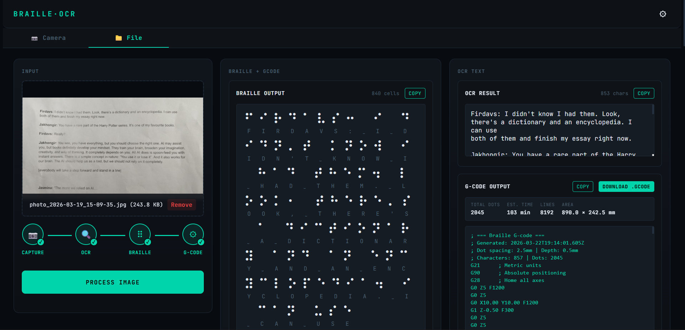

<div align="center">
   
</div>

# Braille Vision

Braille Vision is a web app that converts text from an image into Braille and machine-ready G-code.

It combines:
- OCR with Google Gemini
- Text to Braille conversion
- Braille to CNC/engraver G-code generation

## What this project does

1. Capture an image from camera or upload a file.
2. Extract text using Gemini OCR.
3. Convert extracted text into Braille characters.
4. Generate G-code based on configurable dot geometry and feed settings.
5. Copy or download output for printing/engraving workflows.

## Features

- Camera capture and file upload input modes
- OCR pipeline status tracking (capture, OCR, Braille, G-code)
- Editable OCR text with live Braille and G-code regeneration
- Configurable G-code parameters:
   - Dot spacing
   - Dot depth
   - Start X/Y
   - Feed rate
   - Drill rate
   - Safe Z
- Local persistence of API key and machine settings in browser localStorage
- Dashboard-oriented responsive UI for larger displays

## Tech stack

- React 19 + TypeScript
- Vite
- Google GenAI SDK (`@google/genai`)
- CSS Modules

## Prerequisites

- Node.js 18+ (Node.js 20+ recommended)
- A Gemini API key from Google AI Studio

Get API key: https://aistudio.google.com/apikey

## Getting started

1. Install dependencies:

```bash
npm install
```

2. Start development server:

```bash
npm run dev
```

3. Open the app (default):

http://localhost:3000

4. In the app UI, open Settings and paste your Gemini API key.

Note: This project currently reads the Gemini key from the UI (saved to localStorage), not from `.env.local`.

## Available scripts

- `npm run dev` - Run Vite dev server on port 3000
- `npm run build` - Create production build
- `npm run preview` - Preview production build locally
- `npm run lint` - Type-check with TypeScript (`tsc --noEmit`)
- `npm run clean` - Remove `dist` folder

## Project structure

```text
src/
   components/
      CameraCapture/   # Camera input
      FileUpload/      # File input and drag-drop
      Pipeline/        # Processing status steps
      Settings/        # API key and G-code settings
      OcrResult/       # OCR text editor/output
      BrailleOutput/   # Braille visualization
      GcodeOutput/     # G-code preview/download
   utils/
      braille.ts       # Text -> Braille mapping
      gcode.ts         # Braille -> G-code generator
   App.tsx            # Main app orchestration
```

## Configuration details

G-code is generated from 6-dot Braille cell patterns and machine parameters configured in Settings.

Important behavior:
- Unknown characters are mapped to a fallback Braille symbol.
- Editing OCR text immediately updates Braille and G-code output.
- Saved settings are loaded automatically on next visit.

## Limitations and notes

- OCR quality depends on image quality, language, and Gemini response quality.
- Always validate generated G-code in your simulator/controller before running on hardware.
- Dot spacing/depth values should be calibrated for your specific toolhead and material.

## Build for production

```bash
npm run build
```

Output is generated in the `dist` directory.

## License

Add your preferred license in this repository (for example MIT) if you plan to publish or distribute.
